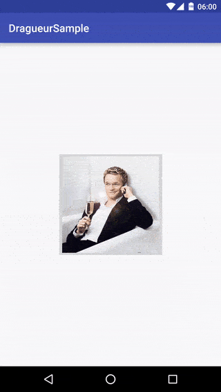
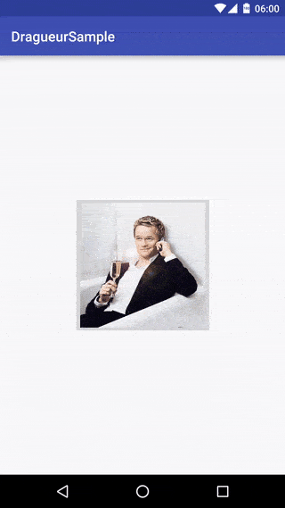

Dragueur
========

[][repo]
[](http://android-arsenal.com/details/1/3534)

Dragueur can move any view with one finger ;)

[][repo]

# Usage

Just declare a DraggableView into your layout

```xml
<com.meetic.dragueur.DraggableView
      android:id="@+id/dragueur"
      android:layout_width="200dp"
      android:layout_height="200dp"
      >

      <!-- YOUR CONTENT -->

<com.meetic.dragueur.DraggableView/>
```

# Customisation

## Exit

By default DraggableView exit when percentX > 75% (of his parent width)
This value can be adjusted with `setMaxDragPercentageX(float)`

## Rotation

[](https://github.com/--------)

```java
draggableView.setRotationEnabled(true);
draggableView.setRotationValue(10f);
```

# Listener
```java
draggableView.setDragListener(new DraggableView.DraggableViewListener() {
            @Override
            public void onDrag(DraggableView draggableView, float percentX, float percentY) {

            }

            @Override
            public void onDraggedStarted(DraggableView draggableView, Direction direction) {

            }

            @Override
            public void onDraggedEnded(DraggableView draggableView, Direction direction) {

            }

            @Override
            public void onDragCancelled(DraggableView draggableView) {

            }
        });
```

# ViewAnimator

All animations of Dragueur can be overriden

```java
draggableView.setViewAnimator(new ViewAnimator() {
            @Override
            public boolean animateExit(@NonNull DraggableView draggableView, Direction direction, int duration) {
                return false;
            }

            @Override
            public boolean animateToOrigin(@NonNull DraggableView draggableView, int duration) {
                return false;
            }

            @Override
            public void update(@NonNull DraggableView draggableView, float percentX, float percentY) {

            }
        });
```

Dragueur comes with `ReturnOriginViewAnimator` and `ExitViewAnimator`

# Download

Add into your **build.gradle**

[  ](https://bintray.com/meetic-android/maven/Dragueur/_latestVersion)

```groovy
compile 'com.meetic.dragueur:dragueur:(last version)'
```

# Credits

A project initiated by Meetic

This project was first developed by Meetic and has been open-sourced since. We will continue working on it.
We encourage the community to contribute to the project by opening tickets and/or pull requests.

[][meetic]

Contributor: [Florent Champigny][florent]

# License

    Copyright 2016 Meetic, Inc.

    Licensed under the Apache License, Version 2.0 (the "License");
    you may not use this file except in compliance with the License.
    You may obtain a copy of the License at

       http://www.apache.org/licenses/LICENSE-2.0

    Unless required by applicable law or agreed to in writing, software
    distributed under the License is distributed on an "AS IS" BASIS,
    WITHOUT WARRANTIES OR CONDITIONS OF ANY KIND, either express or implied.
    See the License for the specific language governing permissions and
    limitations under the License.

[repo]: https://github.com/Meetic/Dragueur
[androidarsenal]: http://android-arsenal.com/details/--------
[meetic]: http://www.meetic.fr/
[florent]: https://github.com/florent37
